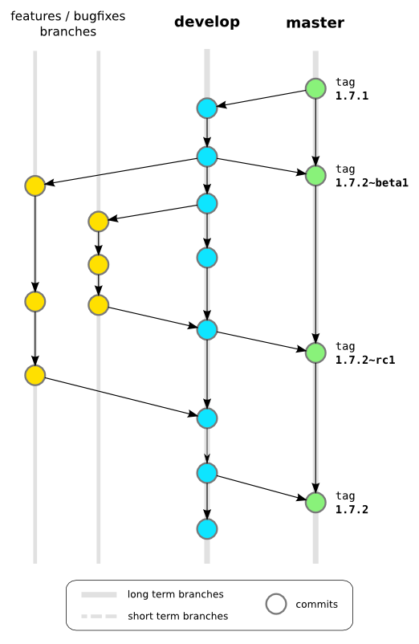
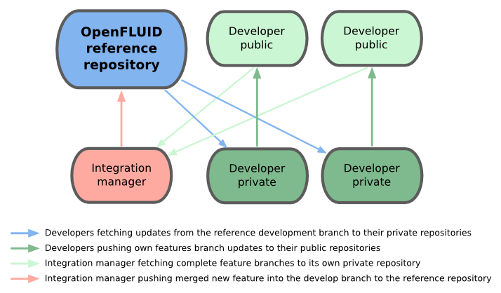
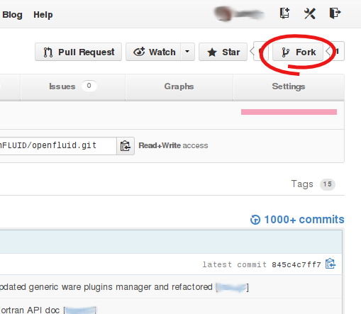
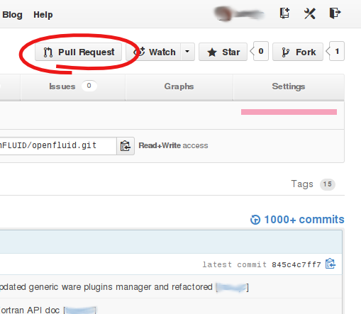

!!! danger "TODO"
    To be reviewed


The OpenFLUID source code is hosted on [GitHub](https://github.com/OpenFLUID), and is made of several Git repositories. They can be cloned with read/write access for registered developers, at the following adresses using either https or ssh protocols (replace username by you registered user name in the following adresses):


|     | https | ssh |
| --- | ----- | --- |
| OpenFLUID framework and applications | [https://username@github.com/OpenFLUID/openfluid.git](https://username@github.com/OpenFLUID/openfluid.git)  | git@github.com:OpenFLUID/openfluid.git |
| ROpenFLUID package for R | [https://username@github.com/OpenFLUID/ropenfluid.git](https://username@github.com/OpenFLUID/ropenfluid.git) | git@github.com:OpenFLUID/ropenfluid.git |
| FluidHub services | [https://username@github.com/OpenFLUID/openfluid-fluidhub.git](https://username@github.com/OpenFLUID/openfluid-fluidhub.git) | git@github.com:OpenFLUID/openfluid-fluidhub.git |


The repositories can also be cloned with public read-only access, at the following addresses using either http or git protocols:

|     | http | git |
| --- | ---- | --- |
| OpenFLUID framework and applications | [http://github.com/OpenFLUID/openfluid.git](http://github.com/OpenFLUID/openfluid.git)  | git@github.com:OpenFLUID/openfluid.git |
| ROpenFLUID package for R | [http://github.com/OpenFLUID/ropenfluid.git](http://github.com/OpenFLUID/ropenfluid.git) | git@github.com:OpenFLUID/ropenfluid.git |
| FluidHub services | [http://github.com/OpenFLUID/openfluid-fluidhub.git](http://github.com/OpenFLUID/openfluid-fluidhub.git) | git@github.com:OpenFLUID/openfluid-fluidhub.git |


When you use Git for the first time, configure your Git user name and email address using the following rules:
* Write you name with only first letter capitalized, *e.g. John Doe* (not John DOE)
* If you have several email adresses, use the email adress related to the OpenFLUID project (your work email address for example)
```
 git config --global user.name "John Doe"
 git config --global user.email "jdoe@foobar.org"
```

As the OpenFLUID source code management is based on Git, knowing Git basics is recommended (clone, commit, branch, fetch, merge, remote, push, ...). Some Git resources online are listed [on this page below](#git-resources), and could be a good entry point for beginners.


## Branching model

The branching model used in the OpenFLUID project relies on two long term branches: the **master** and **develop** branches, and many short term branches: the **feature** branches.

* The **master** branch contains source code in a ready-production state : compiles and builds perfectly, all tests run successfully.
* The **develop** branch, also called integration branch, contains source code with latest delivered development works.
* The **feature** branches are used for development of single features and bug fixes, then merged in the develop branch.


The **master** and **develop** branches can be updated by the _integration manager(s)_ only. They are public with read-only access for contributing _developers_.  


The **feature** branches are for developers and each branch supports the work in progress of a single new feature or a single bugfix:

* A **feature** branch should be named using a shot definition of the work (i.e. fix-wrong-data-id), and should be prefixed by the ticket number if any (i.e. t147-fix-wrong-data-id)
* When created, the source code must come from the **develop** branch
* During the branch life, the source code should be updated from the **develop** branch updates
* Once completed, they are merged in the **develop** branch by _integration manager(s)_.
* A **feature** branch must not be deleted before it is merged in the **develop** branch<br/>

<center>
  
_OpenFLUID branching model using the Git scm_
</center>
<br/>

The OpenFLUID branching model is inspired from the [Vincent Driessen](http://nvie.com/posts/a-successful-git-branching-model/) and [William Durand](http://williamdurand.fr/2012/01/17/my-git-branching-model/) articles on successful Git branching models.

## Workflow

### Overview


* The **master** and **develop** branches are hosted on the [reference Git repository on GitHub](http://github.com/OpenFLUID/).

* The **feature** branches are hosted on _developers_ repositories. These _developers_ repositories must be public with read-only access to _integration manager(s)_.

* For contributing to the OpenFLUID project, it is recommended for _developers_ to have an account on [GitHub](https://github.com/) in order to host their own public repositories and use the fork system provided by this service. However, other hosting is possible so far as it provides read-only access to _integration manager(s)_

<center>
  
_OpenFLUID development workflow using the Git scm (inspired from Scott Chacon's Pro Git Book)_
</center>
<br/>


### Practical example

In this example, the name of the developer is John Doe, and he uses the GitHub forking and hosting facilities for his public repository. The example feature to develop is a new plugin manager for the OpenFLUID platform that will be integrated by the manager when it will be fully developed.


#### On the developer's side


<center>
  
_Fork button on the OpenFLUID repository page on GitHub_
</center>
<br/>
<br/>


**Prerequisite:** Prepare your developer repository (should be done only once)

* Fork of the reference OpenFLUID repository and hosting in your own public repository
    Go on the [OpenFLUID source code repository on GitHub](https://github.com/OpenFLUID), and click on the Fork button (top left of the page)  
    Note that the Fork button performs a clone of the OpenFLUID source code repository and do not keep repositories in sync. It is the responsability of the developer to maintain his repositories up-to-date (see below).
* Clone your public repository in your private local repository
```
git clone https://johndoe@github.com/johndoe/openfluid.git
```
* Add the reference repository as a read-only upstream, and name it upstream
```
git remote add upstream http://github.com/OpenFLUID/openfluid.git
```

Update your private repository from the reference repository
```
git checkout develop
git fetch upstream
git merge upstream/develop
```

Once updated, it is recommended to push your freshly updated private repository to your public repository
```
git checkout develop
git push origin develop
```

Create your local branch for new feature, named new-plugin-manager in this example
```
git checkout -b new-plugin-manager develop
```

Do your work, commit locally (following the [practices for commits](commitsgood)). You can also push to your public repository regularly. This can be done through your IDE (i.e. Eclipse) or using the command line.

For commiting your work:
```
 git commit -m "the message"
```

For pushing your work to your public repository:
```
 git checkout develop
 git fetch upstream
 git merge upstream/develop
 git checkout new-plugin-manager
 git rebase develop
 git push origin new-plugin-manager
```

Once your feature completed and rebased on top of the current develop branch of the reference repository, submit a pull request to the integration manager.  

Give your new-plugin-manager branch as source and the OpenFLUID develop branch as destination<br/>
This should be done using the pull request button on your own public repository page on GitHub


<center>
  
_Request button on the developer public repository page hosted on GitHub_
</center>
<br/>
<br/>


Once the integration manager has merged it into the develop branch of the project, and notified it to you, delete your local new-plugin-manager branch.

#### On the integration manager's side


*It is assumed that the manager has already prepared his private local repository for integration. The remote named origin represents the OpenFLUID reference repository.*<br/>


* Switch to the develop branch and update changes from the develop branch on the reference repository
```
git checkout develop
git fetch origin
git merge origin/develop
```

* Create a local branch for the source code from the developer
```
git checkout -b johndoe-new-plugin-manager
```

* Pull the new-plugin-manager branch from the developer public repository
```
git pull https://github.com/johndoe/openfluid.git new-plugin-manager
```

* Check the merged source code in order to accept or reject it: review code, [and run tests](build)


* If accepted, merge it in the develop branch and push the merged develop branch to the OpenFLUID reference repository
```
git checkout develop
git merge johndoe-new-plugin-manager
git push origin develop
```

* Notify the developers of the develop branch update, or notify about the reject of the proposed development


## Git resources  

Git basics:

* [Pro Git Book by Scott Chacon](http://git-scm.com/book) (also available [in french](http://git-scm.com/book/fr))
* [Git SCM documentation](http://git-scm.com/documentation)
* [Git Immersion](http://gitimmersion.com)
* [Git Magic](http://www-cs-students.stanford.edu/~blynn/gitmagic/)


Git branching model and workflow:

* [A successful Git branching model](http://nvie.com/posts/a-successful-git-branching-model/)
* [My Git branching model, by William Durand](http://williamdurand.fr/2012/01/17/my-git-branching-model/)
* [How to GitHub: Fork, Branch, Track, Squash and Pull Request](http://gun.io/blog/how-to-github-fork-branch-and-pull-request/)
* [Scott Chacon's Git flow](http://scottchacon.com/2011/08/31/github-flow.html)


## Using Git with Eclipse

Recent versions of [Eclipse](http://www.eclipse.org) integrates full git functionalities.
