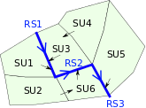
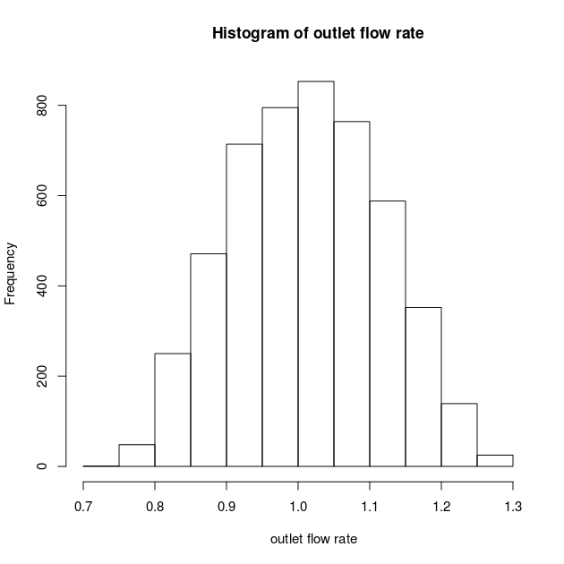
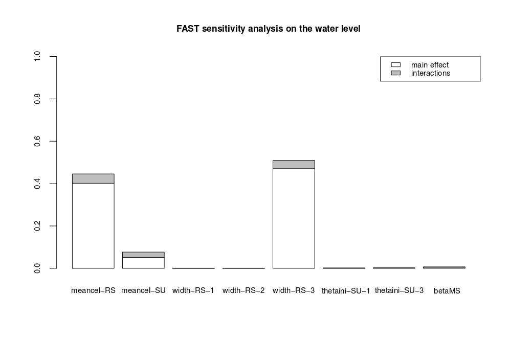

!!! danger "TODO"
    To be reviewed


## Introduction

**Here is a practical use of ROpenFLUID package for uncertainty and sensitivity analyses.**  
It is illustrated on a MHYDAS model (see [notes](../models/mhydas)] for more details about the model and installation). The MHYDAS model is applied on a virtual catchment composed of 9 spatial units : 6 parcels (SUs) and 3 ditches (RSs) (see figure 1).

<center>
  
_Figure 1: Spatial domain on which is applied MHYDAS model_
</center>

This model represents and couples three processes (production function : separation of the rain into runoff and infiltration, water transfers on the SUs surface and water transfers in the RSs). The computed variables of the model are the flow rate at the outlet and water level of each spatial units. The model parameters which will be analysed in the following are :

- the wave mean celerity on SUs,

- the wave mean celerity on RSs,

- the width of the reaches,

- the initial water content of the soil,

- spatialized viscous correction parameter of the "Morel-Seytoux production function".

The two first parameters depend on the transfers model, the three last parameters depend on the spatial units characteristics.


## Step-by-step

Thanks to the ROpenFLUID and sensitivity R packages, uncertainty propagation and sensitivity analyses of these parameters are performed. The R script is described step by step in the following lines. It is resumed at the end of this page. It aims at analysing uncertainty and sensitivity of MHYDAS parameters for two variables : the flow rate and the water level at the outlet of the catchment.


* R packages loading
```
library("ROpenFLUID")    # should be done only once
library("sensitivity")   # should be done only once
```


* Definition of the paths and OpenFLUID simulations
```
dirSimu = "/home/user/OpenFLUID-Projects/test-R-OF/"           # directory of OpenFLUID project
ofsim   = OpenFLUID.openDataset(paste(dirSimu,"IN",sep=""))    # OpenFLUID simulation
OpenFLUID.setCurrentOutputDir(paste(dirSimu,"OUT",sep=""))     # directory of output files
```


* Definition of the OpenFLUID reference solution
```
OpenFLUID.runSimulation(ofsim)
refQ=OpenFLUID.loadResult(ofsim,"RS",3,"flow")
refH=OpenFLUID.loadResult(ofsim,"RS",3,"level")
print(paste("reference cumulative downstream : ",as.character(sum(ref[,2]*OpenFLUID.getDeltaT(ofsim))," m3",sep=""))
print(paste("reference max water level       : ",as.character(max(ref[m",sep=""))
```


* Definition of the global variables
```
OF.listRS = OpenFLUID.getUnitsIDs(ofsim,"RS")   # list of reach segments
OF.listSU = OpenFLUID.getUnitsIDs(ofsim,"SU")   # list of surface units
OF.nT     = as.double(difftime(as.POSIXct(OpenFLUID.getPeriodEndDate(ofsim)),as.POSIXct(OpenFLUID.getPeriodBeginDate(ofsim)),units="s"))/OpenFLUID.getDeltaT(ofsim)
# number of time steps = (end time - begin time) / time step
```


* Definition of the analysed parameters and their characteristics. This R structure allows a generalised definition of the parameters analysed. Here, we analyse the sensitivity of both function parameters (meancel) and input data (width, thetaini, betaMS), on two kind of spatial units (RS and SU), on the whole set of spatial units or only some of them.
```
OF.factors = list(
  isFuncParam   = c(T,T,F,F,F),
  unitType      = c(NA,NA,"RS","SU","SU"),
  factorName    = c("meancel","meancel","width","thetaini","betaMS"),
  listUnit      = list(NA,NA,OF.listRS,c(1,3),NA),
  funcName      = c("water.surf.transfer-rs.hayami","water.surf.transfer-su.hayami",NA,NA,NA),
  ref           = c(0.045,0.2 ,15.0,0.3 ,1.3),
  lowBound      = c(0.01 ,0.01,10.0,0.2 ,1  ),
  upBound       = c(0.5  ,0.5 ,25.0,0.35,1.7)
)
```


* Building of the analysed factors characteristics in an adapted format
```
OF.computeCaractFactor <- function() {
  n    = 0
  inf  = NULL
  sup  = NULL
  name = NULL
  for (i in seq(1,length(OF.factors$isFuncParam))) {
    if (OF.factors$isFuncParam[[i](,2])),")]) {
      n    = n + 1
      inf  = cbind(inf,OF.factors$lowBound[      sup  = cbind(sup,OF.factors$upBound[[i]([i]]))])
      name = cbind(name,paste(OF.factors$factorName[    }
    else {
      if (is.na(OF.factors$listUnit[[i]([i]],as.character(n),sep="-")))])) {
        n    = n + 1
        inf  = cbind(inf,OF.factors$lowBound[        sup  = cbind(sup,OF.factors$upBound[[i]([i]]))])
        name = cbind(name,paste(OF.factors$factorName[      }
      else {
        for (k in OF.factors$listUnit[[i]([i]],OF.factors$unitType[[i]],sep="-")))]) {
          n    = n + 1
          inf  = cbind(inf,OF.factors$lowBound[          sup  = cbind(sup,OF.factors$upBound[[i]([i]]))])
          name = cbind(name,paste(OF.factors$factorName[        }
      }
    }
  }
  return(list(nParam=n,lowBound=inf,upBound=sup,name=name))
}
OF.caractFactor = OF.computeCaractFactor()
```


* Definition of the function running OpenFLUID with the factors set X in matrix format (each line of the matrix X is a factors set)
```
OF.multiRun <- function(X,varOut,fast) {
  if (fast) X=as.matrix(X)

  out = rep(NA,nrow(X))

  # loop on the lines of the factors vector
  for (i in seq(1:nrow(X))) {
    n = 1
    # loop on the type of factors
    for (j in seq(1,length(OF.factors$isFuncParam))) {
      # case the factor is a function parameter
      if (OF.factors$isFuncParam[[j]([i]],OF.factors$unitType[[i]],as.character(k),sep="-")))]) {
        OpenFLUID.setFunctionParam(ofsim,OF.factors$funcName[        n = n + 1
      }
      else {
        # case the factor is an input data and its value in used for all the spatial units (global impact of the factor)
        if (is.na(OF.factors$listUnit[[j]([j]],OF.factors$factorName[[j]],X[i,n]))])) {
          for (k in OpenFLUID.getUnitsIDs(ofsim,OF.factors$uniteSpatial[{
            OpenFLUID.setInputData(ofsim,OF.factors$uniteSpatial[[j]([j]])))],k,OF.factors$factorName[          }
          n = n + 1
        }
        # case the factor is an input data and its value in used for one spatial units (local impact of the factor)
        else {
          for (k in OF.factors$listUnit[[j]([j]],X[i,n]))]) {
            OpenFLUID.setInputData(ofsim,OF.factors$uniteSpatial[            n = n + 1
          }
        }
      }
    }

    # calculation of RMSE with reference solution
    OpenFLUID.runSimulation(ofsim)
    if (varOut=="Q") {
      outOF  = OpenFLUID.loadResult(ofsim,"RS",3,"debit")
      out[i]([j]],k,OF.factors$factorName[[j]],X[i,n])) = sum(outOF[      print(paste("cumulative downstream for simulation no ",as.character(i)," : ",as.character(out[i](,2])*OpenFLUID.getDeltaT(ofsim)))," m3",sep=""))
    }
    else if (varOut=="H") {
      outOF  = OpenFLUID.loadResult(ofsim,"RS",3,"hauteur")
      out[= max(outOF[,2](i]))
      print(paste("max water level for simulation no ",as.character(i)," : ",as.character(out[m",sep=""))
    }
  }
  return(out)
}
```


* Test of the multi-simulation function
```
# definition of the factors set
N = 5000
v = apply(matrix(runif(N*OF.caractFactor$nParam),nrow=N,ncol=OF.caractFactor$nParam),
          MARGIN=1, function(x) {OF.caractFactor$lowBound + x*(OF.caractFactor$upBound-OF.caractFactor$lowBound)})
v = t(v)
colnames(v) <- OF.caractFactor$name
```


* Launch of the multi-simulation on two output variables (Q and H respectively the outstream and the water level at the catchment outlet)
```
debitExut  = OF.multiRun(v,"Q",TRUE)
waterLevel = OF.multiRun(v,"H",TRUE)
```


* Statistical uncertainty propagation analysis on Q and H and drawing of the plots in PDF format
```
pdf(paste(dirSimu,"hist.pdf",sep=""))
for (i in seq(1,ncol(v))) {
  hist(v[,i](i]),"))
  title(sub=OF.caractFactor$name[}
hist(debitExut)
hist(waterLevel)
dev.off()
```


<center>
  
_Figure 2: Uncertainty propagation on the flow rate at the outlet of the catchment  
for an uniform distribution of parameters between their lower and upper bounds_
</center>


* Morris sensitivity analysis on Q and H and drawing of the plots in PDF format
```
OF.morris.Q <- morris(model=OF.multiRun,
                             factors=as.character(OF.caractFactor$name),r=500,
                             design=list(type="oat", levels=25, grid.jump=12),
                             binf=OF.caractFactor$lowBound,
                             bsup=OF.caractFactor$upBound,
                             varOut="Q",fast=F)
# Morris sensitivity analysis
OF.morris.H <- morris(model=OF.multiRun,
                    factors=as.character(OF.caractFactor$name),r=500,
                    design=list(type="oat", levels=25, grid.jump=12),
                    binf=OF.caractFactor$lowBound,
                    bsup=OF.caractFactor$upBound,
                    varOut="H",fast=F)

pdf(paste(dirSimu,"morris.pdf",sep=""))
plot(OF.morris.Q)
title(main="Morris sensitivity analysis on the downstream")
plot(OF.morris.H)
title(main="Morris sensitivity analysis on the water level")
dev.off()
```


* FAST sensitivity analysis on Q and H and drawing of the plots in PDF format
```
OF.bounds <- apply(cbind(t(OF.caractFactor$lowBound), t(OF.caractFactor$upBound)),MARGIN=1,function(x){list(min=x[)
OF.bounds
OF.fast99.Q <- fast99(model=OF.multiRun,
                      factors=as.character(OF.caractFactor$name),
                      n=500,
                      q="qunif",
                      q.arg=OF.bounds,
                      varOut="Q",fast=T)
OF.fast99.H <- fast99(model=OF.multiRun,
                      factors=as.character(OF.caractFactor$name),
                      n=500,
                      q="qunif",
                      q.arg=OF.bounds,
                      varOut="H",fast=T)

pdf(paste(dirSimu,"fast99.pdf",sep=""))
plot(OF.fast99.Q,font.lab=2,font.axis=2)
title(main="FAST sensitivity analysis on the downstream")
plot(OF.fast99.H)
title(main="FAST sensitivity analysis on the downstream")
dev.off()
```


<center>
  
_Figure 3: Sensivity analysis with FAST99 method on the water level at the outlet of the catchment_
</center>


## Complete R script

* Here is the '''complete R script''' to be copied and pasted for execution

```
library("ROpenFLUID")    # should be done only once
library("sensitivity")   # should be done only once

# definition of the paths and OpenFLUID simulations
dirSimu = "/home/user/OpenFLUID-Projects/test-R-OF/"           # directory of OpenFLUID project
ofsim   = OpenFLUID.openDataset(paste(dirSimu,"IN",sep=""))    # OpenFLUID simulation
OpenFLUID.setCurrentOutputDir(paste(dirSimu,"OUT",sep=""))     # directory of output files

# definition of the OpenFLUID reference solution
OpenFLUID.runSimulation(ofsim)
refQ=OpenFLUID.loadResult(ofsim,"RS",3,"flow")
refH=OpenFLUID.loadResult(ofsim,"RS",3,"level")
print(paste("reference cumulative downstream : ",as.character(sum(ref[m3",sep=""))
print(paste("reference max water level       : ",as.character(max(ref[,2](,2])*OpenFLUID.getDeltaT(ofsim)),")))," m",sep=""))

# definition of the global variables
OF.listRS = OpenFLUID.getUnitsIDs(ofsim,"RS")   # list of reach segments
OF.listSU = OpenFLUID.getUnitsIDs(ofsim,"SU")   # list of surface units
OF.nT     = as.double(difftime(as.POSIXct(OpenFLUID.getPeriodEndDate(ofsim)),as.POSIXct(OpenFLUID.getPeriodBeginDate(ofsim)),units="s"))/OpenFLUID.getDeltaT(ofsim)   # number of time steps = (end time - begin time) / time step

# definition of the analysed parameters and their characteristics
OF.factors = list(
  isFuncParam   = c(T,T,F,F,F),
  unitType = c(NA,NA,"RS","SU","SU"),
  factorName    = c("meancel","meancel","width","thetaini","betaMS"),
  listUnit        = list(NA,NA,OF.listRS,c(1,3),NA),
  funcName      = c("water.surf.transfer-rs.hayami","water.surf.transfer-su.hayami",NA,NA,NA),
  ref           = c(0.045,0.2 ,15.0,0.3 ,1.3),
  lowBound      = c(0.01 ,0.01,10.0,0.2 ,1  ),
  upBound      = c(0.5  ,0.5 ,25.0,0.35,1.7)
)

# building of the analysed factors characteristics in an adapted format
OF.computeCaractFactor <- function() {
  n    = 0
  inf  = NULL
  sup  = NULL
  name = NULL
  for (i in seq(1,length(OF.factors$isFuncParam))) {
    if (OF.factors$isFuncParam[{
      n    = n + 1
      inf  = cbind(inf,OF.factors$lowBound[[i]([i]]))])
      sup  = cbind(sup,OF.factors$upBound[      name = cbind(name,paste(OF.factors$factorName[[i]([i]]))],as.character(n),sep="-"))
    }
    else {
      if (is.na(OF.factors$listUnit[{
        n    = n + 1
        inf  = cbind(inf,OF.factors$lowBound[[i]([i]])))])
        sup  = cbind(sup,OF.factors$upBound[        name = cbind(name,paste(OF.factors$factorName[[i]([i]]))],OF.factors$unitType[      }
      else {
        for (k in OF.factors$listUnit[[i]([i]],sep="-")))]) {
          n    = n + 1
          inf  = cbind(inf,OF.factors$lowBound[          sup  = cbind(sup,OF.factors$upBound[[i]([i]]))])
          name = cbind(name,paste(OF.factors$factorName[        }
      }
    }
  }
  return(list(nParam=n,lowBound=inf,upBound=sup,name=name))
}
OF.caractFactor = OF.computeCaractFactor()

# definition of the function running OpenFLUID with the factors set X
OF.multiRun <- function(X,varOut,fast) {
  if (fast) X=as.matrix(X)

  out = rep(NA,nrow(X))

  # loop on the lines of the factors vector
  for (i in seq(1:nrow(X))) {
    n = 1
    # loop on the type of factors
    for (j in seq(1,length(OF.factors$isFuncParam))) {
      # case the factor is a function parameter
      if (OF.factors$isFuncParam[[j]([i]],OF.factors$unitType[[i]],as.character(k),sep="-")))]) {
        OpenFLUID.setFunctionParam(ofsim,OF.factors$funcName[        n = n + 1
      }
      else {
        # case the factor is an input data and its value in used for all the spatial units (global impact of the factor)
        if (is.na(OF.factors$listUnit[[j]([j]],OF.factors$factorName[[j]],X[i,n]))])) {
          for (k in OpenFLUID.getUnitsIDs(ofsim,OF.factors$uniteSpatial[{
            OpenFLUID.setInputData(ofsim,OF.factors$uniteSpatial[[j]([j]])))],k,OF.factors$factorName[          }
          n = n + 1
        }
        # case the factor is an input data and its value in used for one spatial units (local impact of the factor)
        else {
          for (k in OF.factors$listUnit[[j]([j]],X[i,n]))]) {
            OpenFLUID.setInputData(ofsim,OF.factors$uniteSpatial[            n = n + 1
          }
        }
      }
    }

    # calculation of RMSE with reference solution
    OpenFLUID.runSimulation(ofsim)
    if (varOut=="Q") {
      outOF  = OpenFLUID.loadResult(ofsim,"RS",3,"debit")
      out[i]([j]],k,OF.factors$factorName[[j]],X[i,n])) = sum(outOF[      print(paste("cumulative downstream for simulation no ",as.character(i)," : ",as.character(out[i](,2])*OpenFLUID.getDeltaT(ofsim)))," m3",sep=""))
    }
    else if (varOut=="H") {
      outOF  = OpenFLUID.loadResult(ofsim,"RS",3,"hauteur")
      out[= max(outOF[,2](i]))
      print(paste("max water level for simulation no ",as.character(i)," : ",as.character(out[m",sep=""))
    }
  }
  return(out)
}

# test of the mutli-simulation function
# definition of the factors set
N = 5000
v = apply(matrix(runif(N*OF.caractFactor$nParam),nrow=N,ncol=OF.caractFactor$nParam),
          MARGIN=1, function(x) {OF.caractFactor$lowBound + x*(OF.caractFactor$upBound-OF.caractFactor$lowBound)})
v = t(v)
colnames(v) <- OF.caractFactor$name

# launch of the multi-simulation
debitExut  = OF.multiRun(v,"Q",TRUE)
waterLevel = OF.multiRun(v,"H",TRUE)

# statistical uncertainty analysis
pdf(paste(dirSimu,"hist.pdf",sep=""))
for (i in seq(1,ncol(v))) {
  hist(v[,i](i]),"))
  title(sub=OF.caractFactor$name[}
hist(debitExut)
hist(waterLevel)
dev.off()

# Morris sensitivity analysis
OF.morris.Q <- morris(model=OF.multiRun,
                             factors=as.character(OF.caractFactor$name),r=500,
                             design=list(type="oat", levels=25, grid.jump=12),
                             binf=OF.caractFactor$lowBound,
                             bsup=OF.caractFactor$upBound,
                             varOut="Q",fast=F)
# Morris sensitivity analysis
OF.morris.H <- morris(model=OF.multiRun,
                    factors=as.character(OF.caractFactor$name),r=500,
                    design=list(type="oat", levels=25, grid.jump=12),
                    binf=OF.caractFactor$lowBound,
                    bsup=OF.caractFactor$upBound,
                    varOut="H",fast=F)

pdf(paste(dirSimu,"morris.pdf",sep=""))
plot(OF.morris.Q)
title(main="Morris sensitivity analysis on the downstream")
plot(OF.morris.H)
title(main="Morris sensitivity analysis on the water level")
dev.off()

# FAST sensitivity analysis
OF.bounds <- apply(cbind(t(OF.caractFactor$lowBound), t(OF.caractFactor$upBound)),MARGIN=1,function(x){list(min=x[1](i])),max=x[2])} )
OF.bounds
OF.fast99.Q <- fast99(model=OF.multiRun,
                      factors=as.character(OF.caractFactor$name),
                      n=500,
                      q="qunif",
                      q.arg=OF.bounds,
                      varOut="Q",fast=T)
OF.fast99.H <- fast99(model=OF.multiRun,
                      factors=as.character(OF.caractFactor$name),
                      n=500,
                      q="qunif",
                      q.arg=OF.bounds,
                      varOut="H",fast=T)

pdf(paste(dirSimu,"fast99.pdf",sep=""))
plot(OF.fast99.Q,font.lab=2,font.axis=2)
title(main="FAST sensitivity analysis on the downstream")
plot(OF.fast99.H)
title(main="FAST sensitivity analysis on the downstream")
dev.off()
```
